# 1Panel

## 准备工作

### 系统环境

**系统：** `Ubuntu 20.04`

**配置：** `2H4G` +


### 安装 1Panel

**安装文档：** [https://1panel.cn/docs/v2/installation/online\_installation/](https://1panel.cn/docs/v2/installation/online_installation/)

**安装过程：**

```shell
 ██╗    ██████╗  █████╗ ███╗   ██╗███████╗██╗     
███║    ██╔══██╗██╔══██╗████╗  ██║██╔════╝██║     
╚██║    ██████╔╝███████║██╔██╗ ██║█████╗  ██║     
 ██║    ██╔═══╝ ██╔══██║██║╚██╗██║██╔══╝  ██║     
 ██║    ██║     ██║  ██║██║ ╚████║███████╗███████╗
 ╚═╝    ╚═╝     ╚═╝  ╚═╝╚═╝  ╚═══╝╚══════╝╚══════╝
[1Panel Log]: ======================= 开始安装 ======================= 
设置1Panel安装目录 (默认为/opt): 
[1Panel Log]: 您选择的安装路径是 /opt 
[1Panel Log]: ... 在线安装Docker 
[1Panel Log]: Docker安装成功 
Created symlink /etc/systemd/system/multi-user.target.wants/docker.service → /etc/systemd/system/docker.service.
设置1Panel端口 (默认是 11803):11803
[1Panel Log]: 您设置的端口是:  11803 
设置1Panel安全入口 (默认是 daab25c3fa): 
[1Panel Log]: 设置1Panel安全入口 (默认是 daab25c3fa 
设置1Panel面板用户 (默认是 3eeebb5afd): 
[1Panel Log]: 您设置的面板用户是 3eeebb5afd 
[1Panel Log]: 设置1Panel面板密码，设置后按回车键继续 (默认是 918712928a):  

[1Panel Log]: 正在配置1Panel服务 
Created symlink /etc/systemd/system/multi-user.target.wants/1panel.service → /etc/systemd/system/1panel.service.
[1Panel Log]: 正在启动1Panel服务 
[1Panel Log]: 1Panel服务已成功启动！ 
[1Panel Log]:  
[1Panel Log]: =================感谢您的耐心等待，安装已完成================== 
[1Panel Log]:  
[1Panel Log]: 请使用您的浏览器访问面板:  
[1Panel Log]: 外部地址:  http://11.22.333.444:11803/daab25c3fa 
[1Panel Log]: 内部地址:  http://10.60.211.244:11803/daab25c3fa 
[1Panel Log]: 面板用户:  3eeebb5afd 
[1Panel Log]: 面板密码:  918712928a 
[1Panel Log]:  
[1Panel Log]: 官方网站: https://1panel.cn 
[1Panel Log]: 项目文档: https://1panel.cn/docs 
[1Panel Log]: 代码仓库: https://github.com/1Panel-dev/1Panel 
[1Panel Log]: 前往 1Panel 官方论坛获取帮助: https://bbs.fit2cloud.com/c/1p/7 
[1Panel Log]:  
[1Panel Log]: 如果您使用的是云服务器，请在安全组中打开端口 11803 
[1Panel Log]:  
[1Panel Log]: 为了您的服务器安全，离开此屏幕后您将无法再次看到您的密码，请记住您的密码。 
[1Panel Log]:  
[1Panel Log]: ================================================================ 
ubuntu@10-60-211-244:/tmp/1panel-v1.10.29-lts-linux-amd64$ 
```

到这一步就安装成功了

如果外部地址无法访问就在相关平台给服务器安全组放行 `11803` 端口


### 服务器环境

进入到 `1Panel` 后，在应用商店中找到以下应用进行安装，注意版本号：

**openresty：** `1.21.4.3-3-3-focal`

**mysql：** `8.0.42`

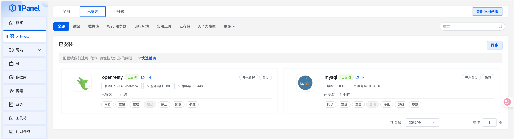


## 进入主题

**部署顺序：** 后端、控制端、前端

当控制端和前端出现问题时，`90%` 归根于后端，所以大家一定要按照顺序来！！！


### 后端

#### 下载源码

**下载 Jar 文件：** [https://github.com/LiuYuYang01/ThriveX-Server/releases](https://github.com/LiuYuYang01/ThriveX-Server/releases)

选择最上面的最新版，然后找到 `Assets` 中的 `blog.jar` 点击下载

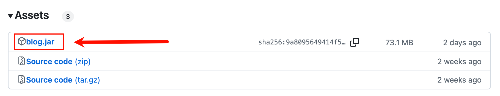


**下载 SQL 文件：** [https://github.com/LiuYuYang01/ThriveX-Server/blob/master/ThriveX.sql](https://github.com/LiuYuYang01/ThriveX-Server/blob/master/ThriveX.sql)

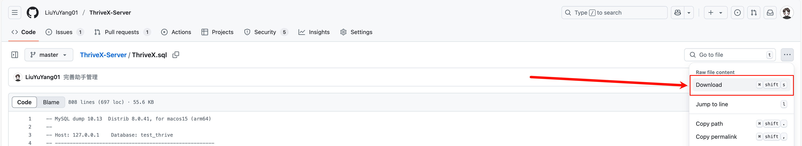


#### 配置环境变量

环境变量介绍

```env
PORT=自定义项目端口号

DB_INFO=数据库信息
DB_USERNAME=数据库用户名
DB_PASSWORD=数据库密码
```

环境变量示例

```env
java -jar blog.jar --PORT=9003 --DB_INFO=mysql:3306/thrivex --DB_USERNAME=thrivex --DB_PASSWORD=xxxxxxxx
```


#### 创建数据库

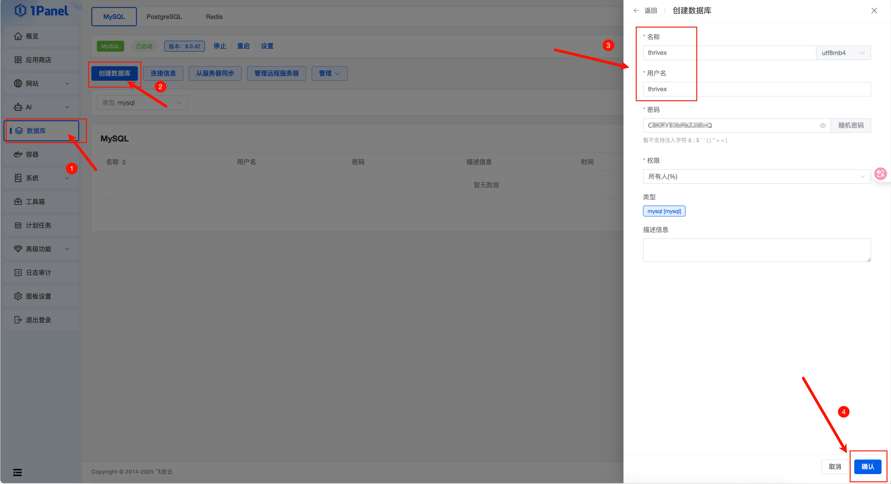


#### 导入数据库

点击左侧菜单中的 数据库 选项后，在列表中找到刚刚创建的数据库，在右侧按钮中点击 **导入备份** 按钮弹出该界面 进行导入数据

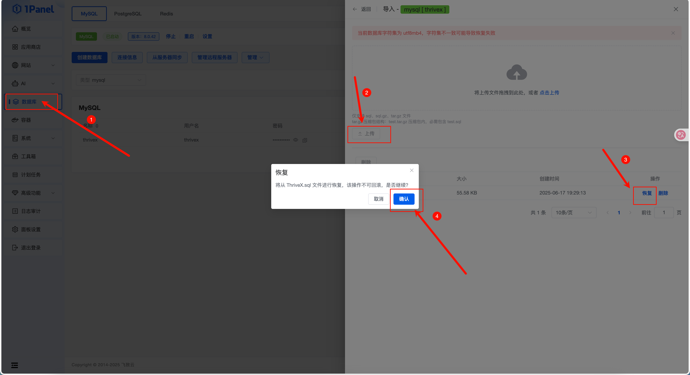


#### 上传源码

在系统 / 文件中创建一个目录 `wwwroot/blog_api`，这个目录可以自定义

然后将刚刚下载的 `blog.jar` 上传到这个目录

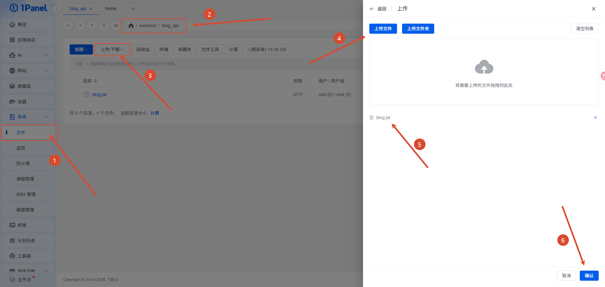


#### 创建运行环境

4：注意版本要选择 `1.8` 别选错了

5：启动命令检查检查别填错了

7：端口默认都设置 `9003`

8：名称和容器名都可以自定义

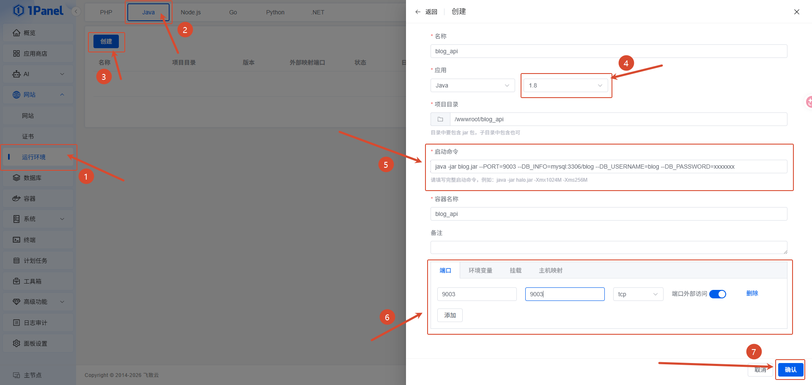

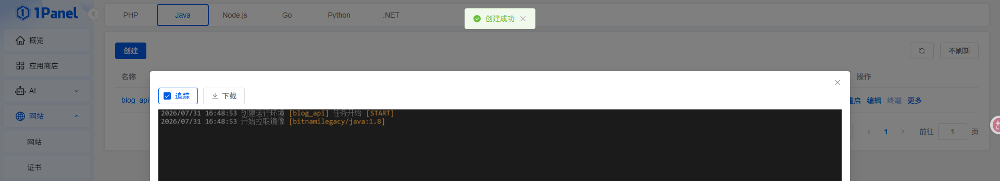


创建成功后查看运行环境的状态是否为 **已启动**

如果是则表示目前一切顺利，否则请查看数据库密码、环境变量等是否正确

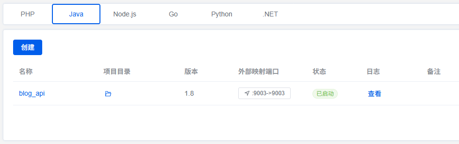


#### 创建网站

选择刚刚创建的运行环境，并绑定自己的域名

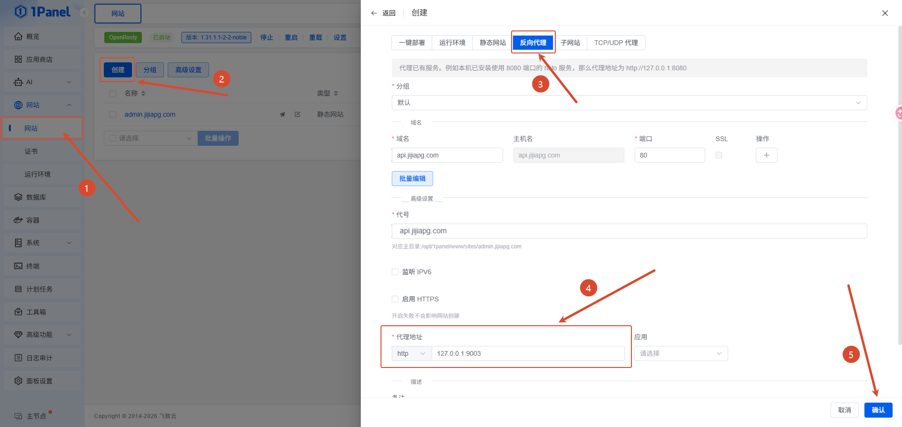


#### 配置 SSL

创建网站成功后，点击蓝色的网站名称进入到网站设置，选择 `HTTPS`，然后开启

配置自己的证书信息，证书大家自行想办法，网上有很多免费的

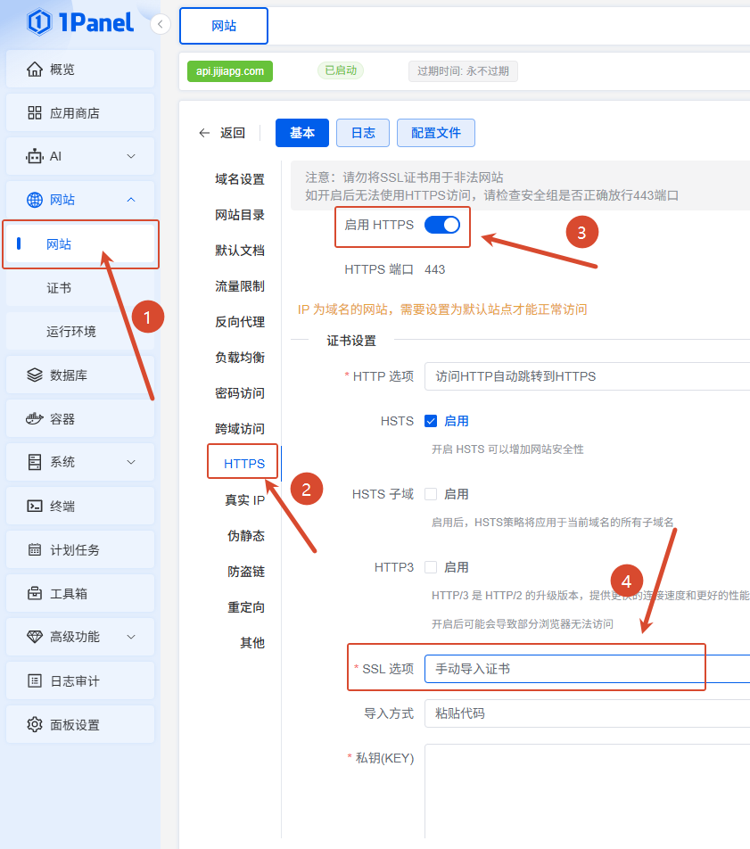

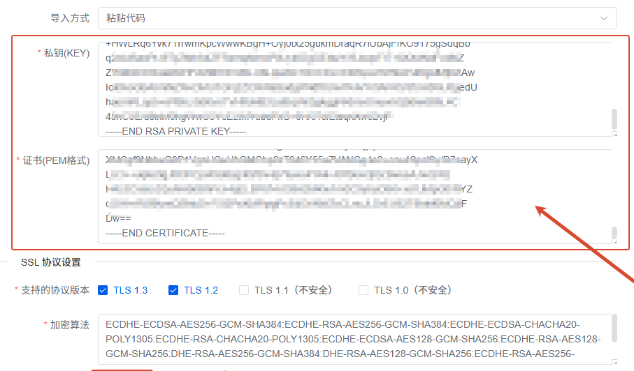

配置好之后点击下方按钮保存


#### 验证是否成功

**访问：**https://api.jijiapg.com/doc.html#/home

选择用户登录接口进行测试

```json
{
  "password": "123456",
  "username": "admin"
}
```


当响应的 `code` 为 `200` 则表示一切顺利，后端部署成功 🎉🎉🎉

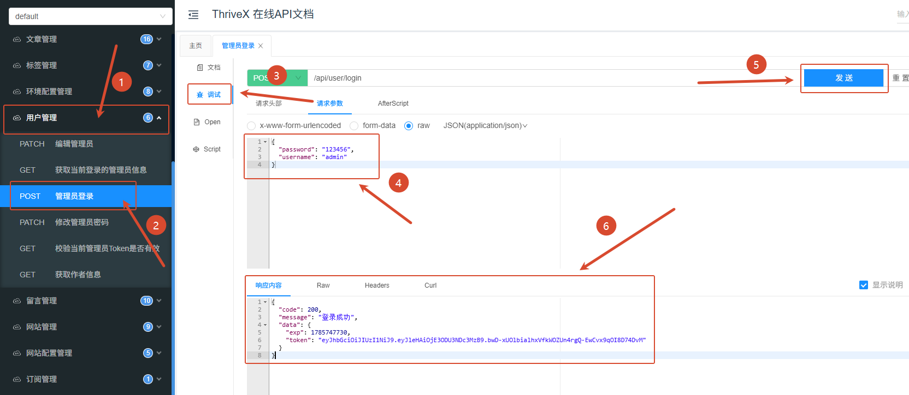

此刻你应该给自己鼓鼓掌 👏🏻👏🏻👏🏻


### 控制端

#### 下载源码

**下载 Zip 文件：** [https://github.com/LiuYuYang01/ThriveX-Admin/releases](https://github.com/LiuYuYang01/ThriveX-Admin/releases)

跟后端一样选择最上面的最新版，不同的是这次下载 `Source code` 这个文件

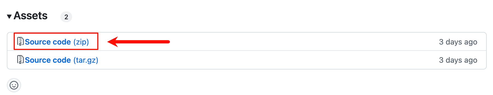


#### 配置环境变量

下载源码后用你熟悉的代码编辑器打开

随后执行 `npm i` 命令安装依赖，注意 `Nodejs` 版本要 `>=20` 

安装成功后项目根目录会出现 `node_modules` 目录

```
yang@ ThriveX-Admin % npm i

added 11 packages, changed 42 packages, and audited 726 packages in 2s

195 packages are looking for funding
  run `npm fund` for details

12 vulnerabilities (1 low, 8 moderate, 3 high)

To address all issues, run:
  npm audit fix

Run `npm audit` for details.
```


#### 项目打包

接下来后找到项目根目录中的 `.env` 文件，把相关信息改成自己的，注意后端域名协议必须是 `https`

配置好之后通过 `npm run build` 进行打包

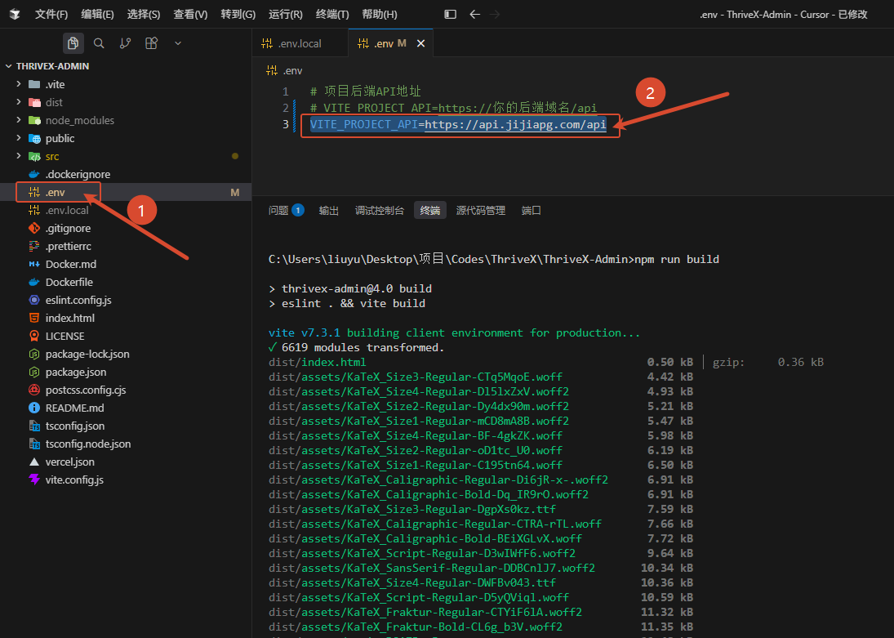

打包完成后，你的项目根目录就会新增一个 `dist` 目录

接下来我们需要将 `dist` 目录中的文件压缩为 `.zip` 格式，待会要上传到服务器


#### 创建网站

**注意：**创建网站时选择静态网站，别选错了

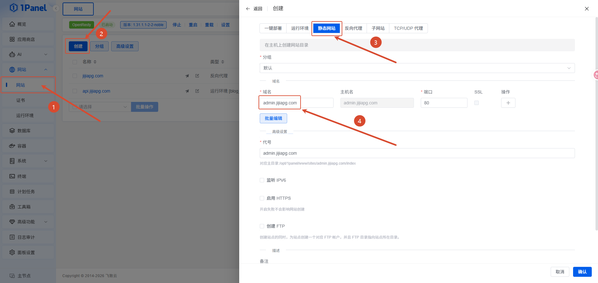


#### 配置 SSL

配置方法跟后端一样，通用的


#### 上传源码

点击进入到网站对应的目录，然后当前默认的文件都删掉

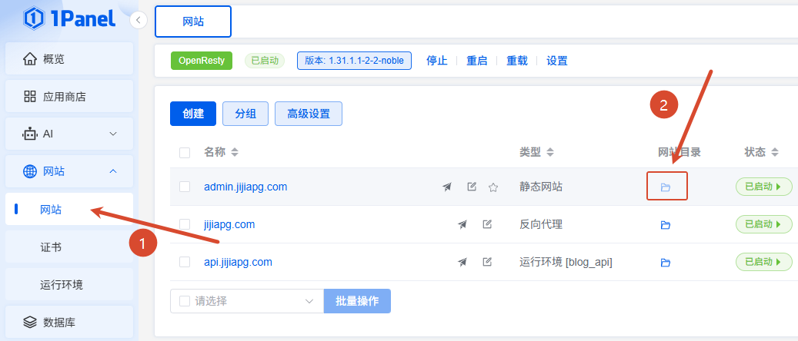


上传刚刚打包后的文件

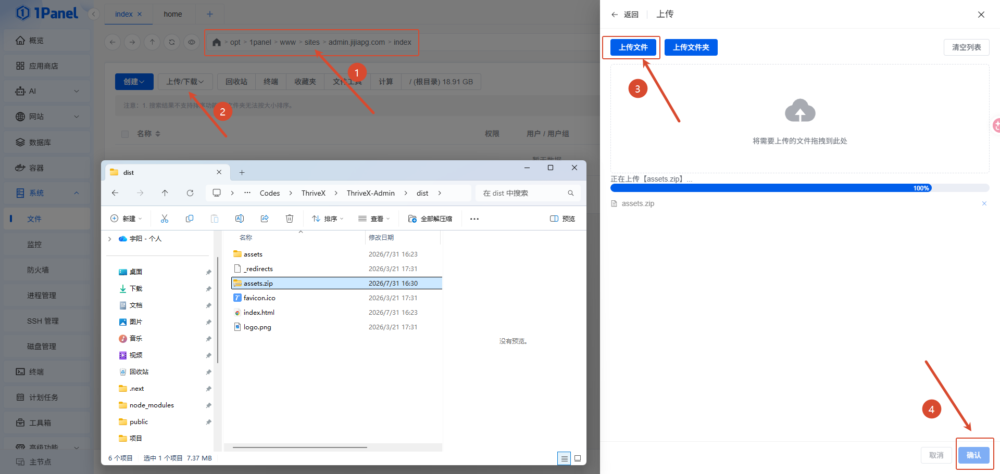

上传完成后解压刚刚上传的 `assets.zip` 压缩包


#### 解决刷新 404

单页面项目都会存在一种问题，第一次进入页面是正常的，但在刷新时候会导致 `404`，我们可以通过以下方式解决

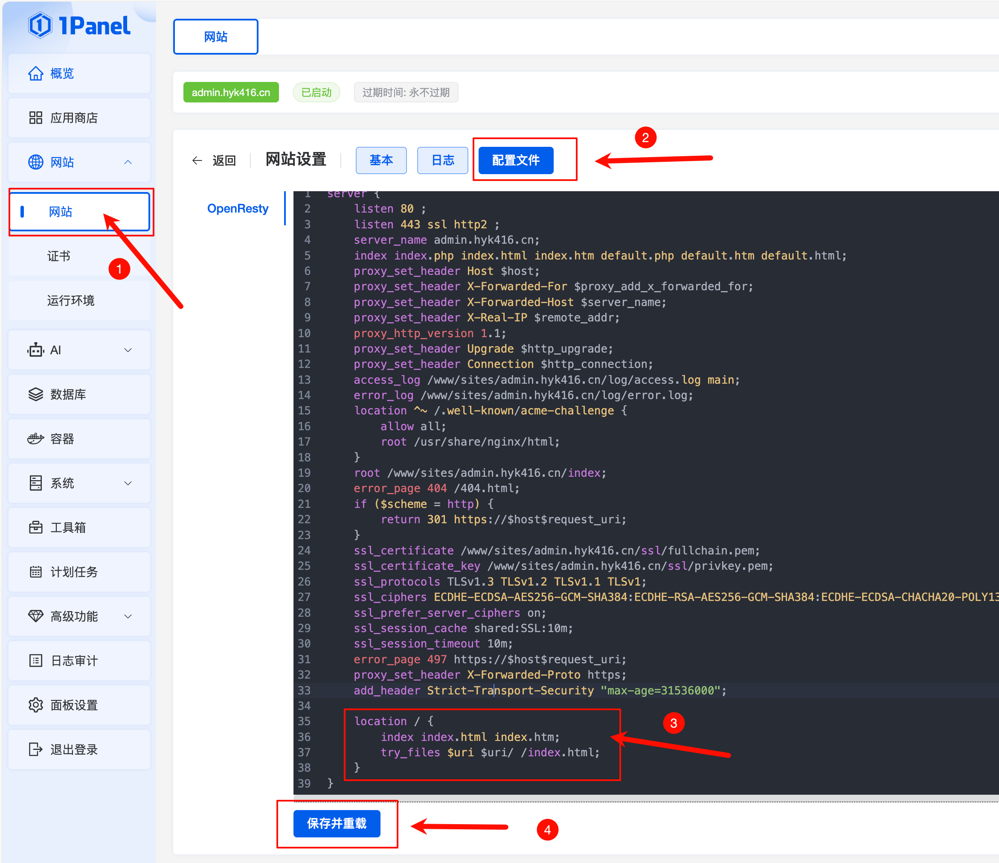

复制粘贴到配置中

```nginx
location / {
	index index.html index.htm;
  try_files $uri $uri/ /index.html; 
}
```


#### 验证是否成功

**访问：**[https://admin.jijiapg.com/](https://admin.jijiapg.com/login) 进行登录

**账号：** admin   |   **密码：** 123456

只要后端没问题，前端和控制端基本上不会出问题

如果登录成功则表示控制端部署成功 🎉🎉🎉

此刻你应该给自己鼓鼓掌 👏🏻👏🏻👏🏻


### 前端

#### 下载源码

**下载 Zip 文件：** [https://github.com/LiuYuYang01/ThriveX-Blog/releases](https://github.com/LiuYuYang01/ThriveX-Blog/releases)

跟控制端一样下载 `Source code` 这个文件


#### 配置环境变量

安装依赖和打包命令都与控制端一致，唯一不同的是控制端打包后会生成一个 `dist` 目录，而前端生成的是 `.next` 目录。

它们的作用都是一样的，待会我们需要这些目录上传到服务器

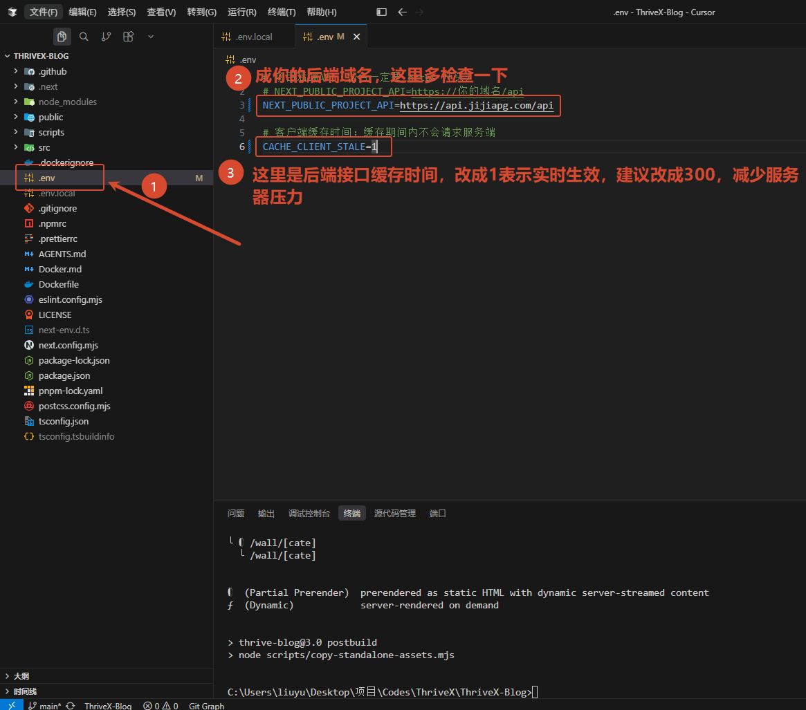


#### 上传源码

将这些文件压缩，上传到服务器，注意别把 `node_modules` 上传进去

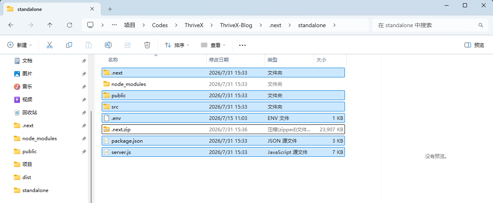


在系统 / 文件中创建一个目录 `wwwroot/blog`，把刚刚压缩的文件上传到这里并解压

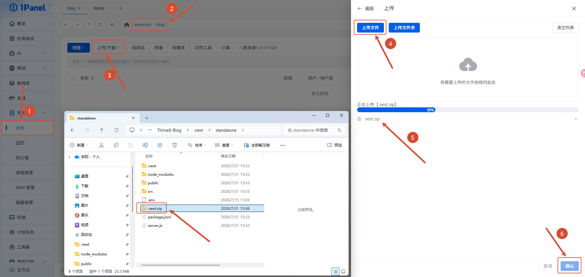

解压之后的结构

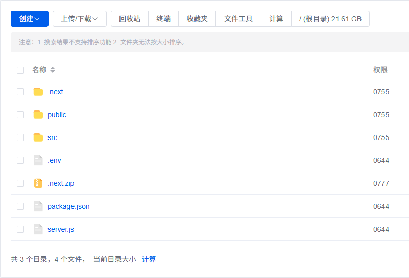


#### 创建运行环境

版本选择：`20.19.3`

启动命令：`node /wwwroot/blog/server.js`

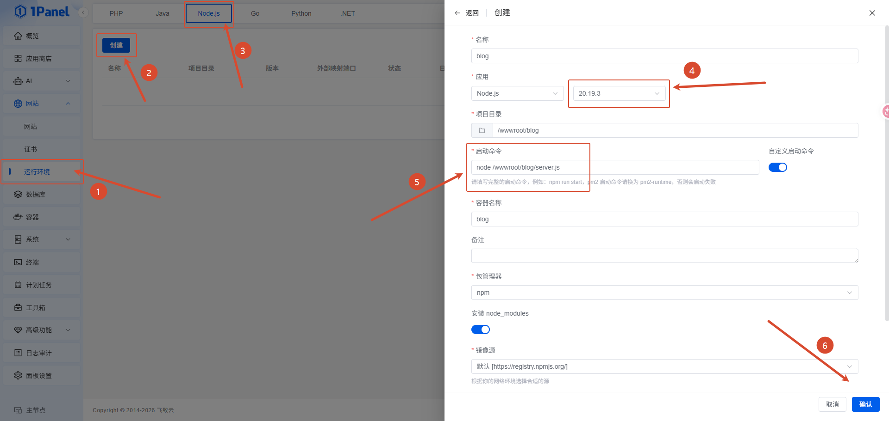

底部还有个端口选项，都选择 `3000`


如果这里状态为 **已启动**，则表示截止目前为止一切顺利

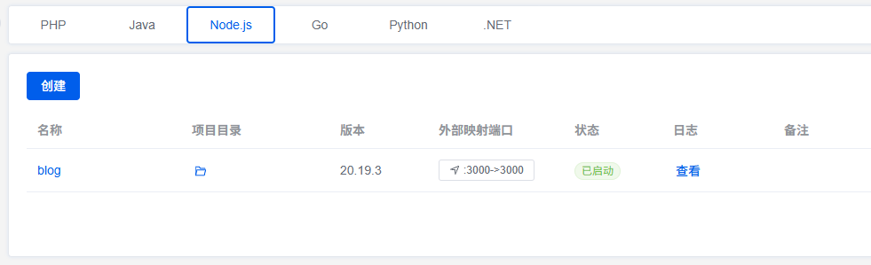


#### 创建网站

这里记得选择反向代理，别选错了

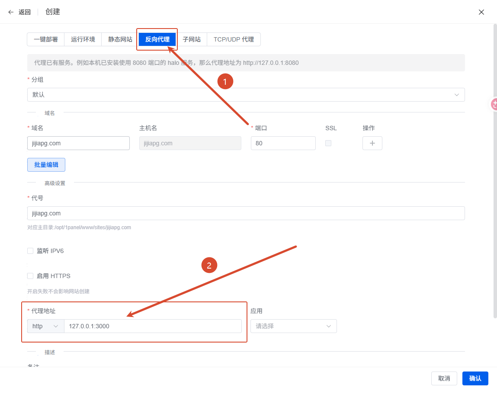


#### 配置 SSL

配置方法跟后端一样，请往上看


#### 验证是否成功

**访问：** [https://](https://hyk416.cn/)[jijiapg.com](http://jijiapg.com)

只要后端没问题，前端和控制端基本上不会出问题

到这一步你就完成了整个项目的部署 🎉🎉🎉

此刻你应该给自己热烈的掌声 👏🏻👏🏻👏🏻


## 技术支持

如果在部署过程中遇到了问题，可以选择付费，每个问题 `20` 元，不议价，当然不提倡这种方式。

**推荐：** 将下面 `3` 个地址分别打开，在右侧 **三连** + **关注** 截图发给我即可获得一次免费问题答疑服务

**微信：** `liuyuyang2023`  **备注：** 技术支持


| 项目  | 地址                                                                                       |
| --- | ---------------------------------------------------------------------------------------- |
| 前端  | [LiuYuYang01/ThriveX-Blog (github.com)](https://github.com/LiuYuYang01/ThriveX-Blog)     |
| 控制端 | [LiuYuYang01/ThriveX-Admin (github.com)](https://github.com/LiuYuYang01/ThriveX-Admin)   |
| 后端  | [LiuYuYang01/ThriveX-Server (github.com)](https://github.com/LiuYuYang01/ThriveX-Server) |


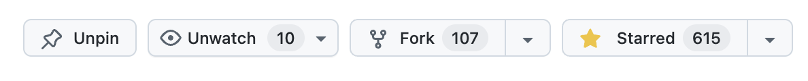

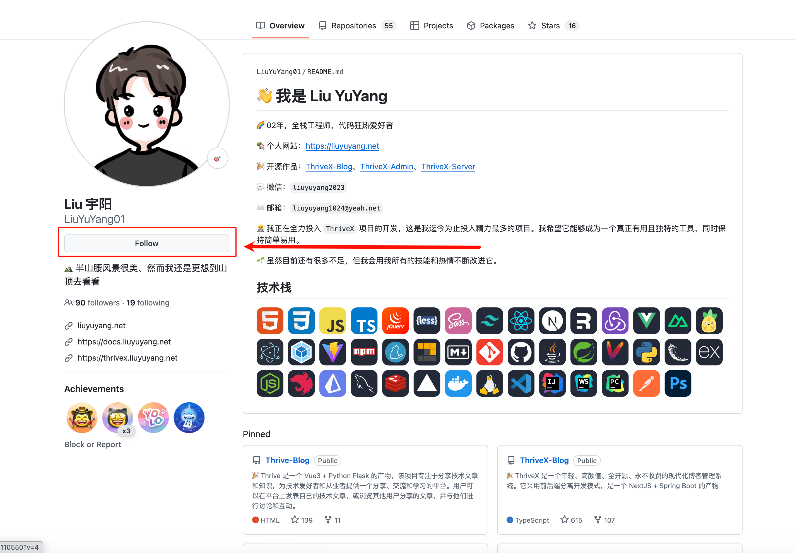


## 官方交流群

大家在部署时遇到任何问题欢迎加入官方交流群进行探索

**加微信：** `liuyuyang2023`   **记得备注：** 拉群


## 版权声明

为了项目的生态越来越强大，作者在这里恳请大家保留 `ThriveX` 博客系统版权

在项目 `Star` 突破 `2K` 后大家可自由选择删除 `or` 保留

如果对该项目进行二次开发，最终需将项目进行开源并保留版权 且 禁止任何商业行为

最后希望大家能够请遵守开源协议：***AGPL-3.0 license***

弘扬开源精神，从你我做起！